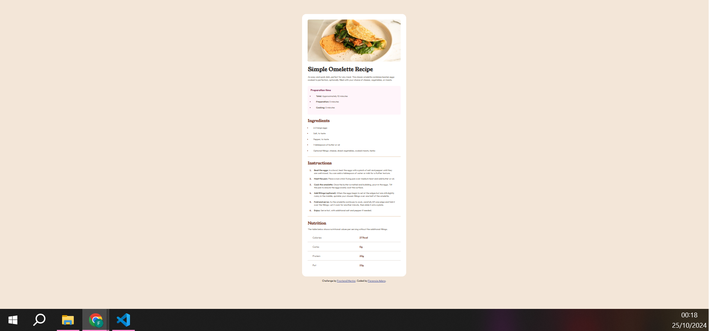

# Frontend Mentor - Recipe page solution

This is a solution to the [Recipe page challenge on Frontend Mentor](https://www.frontendmentor.io/challenges/recipe-page-KiTsR8QQKm). Frontend Mentor challenges help you improve your coding skills by building realistic projects.

## Table of contents

- [Overview](#overview)
  - [The challenge](#the-challenge)
  - [Screenshot](#screenshot)
  - [Links](#links)
- [My process](#my-process)
  - [Built with](#built-with)
  - [What I learned](#what-i-learned)
- [Author](#author)

## Overview

Este proyecto es una landing page diseñada para una receta de cocina. El objetvivo es presentar las intrucciones, ingredientes y su valor nutricional de un omelette. Es una interfaz moderna y responsiva.

### The challenge

Crear una tarjeta, que sea fácil de leer, con los requerimientos impuestos por Frontend Mentor, adaptada a diferentes resoluciones de pantalla, asegurando una experiencia fluida en cualquier dispositivo.

### Screenshot

### Links

- Solution URL: [Add solution URL here](https://your-solution-url.com)

## My process

### Built with

- Semantic HTML5 markup
- CSS custom properties
- Flexbox
- CSS Grid
- VS code (Editor)

### What I learned

Durante este proyecto, perfeccioné mis habilidades en HTML y CSS utilizando un diseño responsive a través de media queries.

## Author

- Website - [GitHub](https://github.com/floradaro)
- Frontend Mentor - [@floradaro](https://www.frontendmentor.io/profile/floradaro)
- LinkedIn - [@floradaro](https://www.linkedin.com/in/floradaro/)
